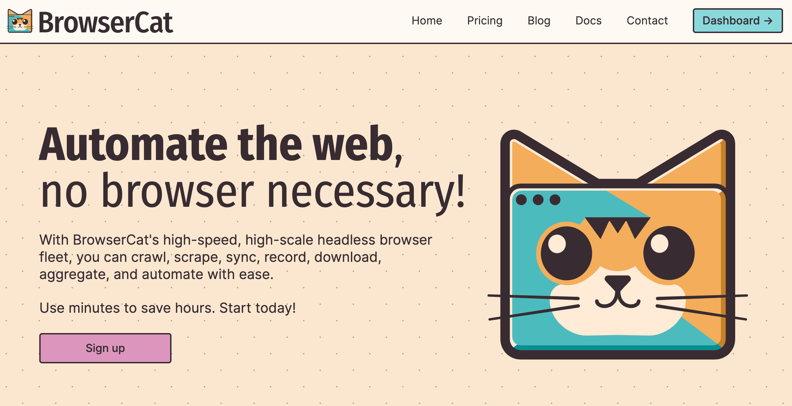

<div align="center">

[](https://browsercat.com)

# [Browsercat](https://browsercat.com)

Providing purr-fect headless browser access via utility endpoints and direct websocket connections.

</div>

## Requirements

Building the API client library requires:

1. Java 1.8+
2. Maven (3.8.3+)/Gradle (7.2+)

If you are adding this library to an Android Application or Library:

3. Android 8.0+ (API Level 26+)

## Installation<a id="installation"></a>
<div align="center">
  <a href="https://konfigthis.com/sdk-sign-up?company=BrowserCat&language=Java">
    
  </a>
</div>

### Maven users

Add this dependency to your project's POM:

```xml
<dependency>
  <groupId>com.konfigthis</groupId>
  <artifactId>browser-cat-java-sdk</artifactId>
  <version>1.0.0</version>
  <scope>compile</scope>
</dependency>
```

### Gradle users

Add this dependency to your `build.gradle`:

```groovy
// build.gradle
repositories {
  mavenCentral()
}

dependencies {
   implementation "com.konfigthis:browser-cat-java-sdk:1.0.0"
}
```

### Android users

Make sure your `build.gradle` file as a `minSdk` version of at least 26:
```groovy
// build.gradle
android {
    defaultConfig {
        minSdk 26
    }
}
```

Also make sure your library or application has internet permissions in your `AndroidManifest.xml`:

```xml
<!--AndroidManifest.xml-->
<?xml version="1.0" encoding="utf-8"?>
<manifest xmlns:android="http://schemas.android.com/apk/res/android"
    xmlns:tools="http://schemas.android.com/tools">
    <uses-permission android:name="android.permission.INTERNET"/>
</manifest>
```

### Others

At first generate the JAR by executing:

```shell
mvn clean package
```

Then manually install the following JARs:

* `target/browser-cat-java-sdk-1.0.0.jar`
* `target/lib/*.jar`

## Getting Started

Please follow the [installation](#installation) instruction and execute the following Java code:

```java
import com.konfigthis.client.ApiClient;
import com.konfigthis.client.ApiException;
import com.konfigthis.client.ApiResponse;
import com.konfigthis.client.BrowserCat;
import com.konfigthis.client.Configuration;
import com.konfigthis.client.auth.*;
import com.konfigthis.client.model.*;
import com.konfigthis.client.api.ApiKeysApi;
import java.util.List;
import java.util.Map;
import java.util.UUID;

public class Example {
  public static void main(String[] args) {
    Configuration configuration = new Configuration();
    configuration.host = "https://api.browsercat.com";
    
    configuration.jwtCookie  = "YOUR API KEY";
    
    configuration.keyHeader  = "YOUR API KEY";
    BrowserCat client = new BrowserCat(configuration);
    String name = "name_example";
    String role = "member";
    OffsetDateTime expiredAt = OffsetDateTime.now();
    try {
      KeySecret result = client
              .apiKeys
              .createApiKey(name)
              .role(role)
              .expiredAt(expiredAt)
              .execute();
      System.out.println(result);
      System.out.println(result.getKeyId());
      System.out.println(result.getName());
      System.out.println(result.getRole());
      System.out.println(result.getLastFour());
      System.out.println(result.getExpiredAt());
      System.out.println(result.getSecret());
    } catch (ApiException e) {
      System.err.println("Exception when calling ApiKeysApi#createApiKey");
      System.err.println("Status code: " + e.getStatusCode());
      System.err.println("Reason: " + e.getResponseBody());
      System.err.println("Response headers: " + e.getResponseHeaders());
      e.printStackTrace();
    }

    // Use .executeWithHttpInfo() to retrieve HTTP Status Code, Headers and Request
    try {
      ApiResponse<KeySecret> response = client
              .apiKeys
              .createApiKey(name)
              .role(role)
              .expiredAt(expiredAt)
              .executeWithHttpInfo();
      System.out.println(response.getResponseBody());
      System.out.println(response.getResponseHeaders());
      System.out.println(response.getStatusCode());
      System.out.println(response.getRoundTripTime());
      System.out.println(response.getRequest());
    } catch (ApiException e) {
      System.err.println("Exception when calling ApiKeysApi#createApiKey");
      System.err.println("Status code: " + e.getStatusCode());
      System.err.println("Reason: " + e.getResponseBody());
      System.err.println("Response headers: " + e.getResponseHeaders());
      e.printStackTrace();
    }
  }
}

```

## Documentation for API Endpoints

All URIs are relative to *https://api.browsercat.com*

Class | Method | HTTP request | Description
------------ | ------------- | ------------- | -------------
*ApiKeysApi* | [**createApiKey**](docs/ApiKeysApi.md#createApiKey) | **POST** /auth/keys | Create an API key
*ApiKeysApi* | [**getKey**](docs/ApiKeysApi.md#getKey) | **GET** /auth/keys/{keyId} | Retrieve an API key
*ApiKeysApi* | [**listAll**](docs/ApiKeysApi.md#listAll) | **GET** /auth/keys | List API keys
*ApiKeysApi* | [**revokeKey**](docs/ApiKeysApi.md#revokeKey) | **DELETE** /auth/keys/{keyId} | Revoke an API key
*ApiKeysApi* | [**updateApiKey**](docs/ApiKeysApi.md#updateApiKey) | **PUT** /auth/keys/{keyId} | Update an API key
*ApiKeysApi* | [**updateKey**](docs/ApiKeysApi.md#updateKey) | **PATCH** /auth/keys/{keyId} | Patch an API key
*BillingApi* | [**getActiveSubscription**](docs/BillingApi.md#getActiveSubscription) | **GET** /billing/subscriptions/current | Get active subscription
*BillingApi* | [**getInvoicePdf**](docs/BillingApi.md#getInvoicePdf) | **GET** /billing/invoices/{invId}.pdf | Get PDF receipt for specific invoice
*BillingApi* | [**getSpecificInvoice**](docs/BillingApi.md#getSpecificInvoice) | **GET** /billing/invoices/{invId} | Get specific invoice
*BillingApi* | [**getSpecificSubscription**](docs/BillingApi.md#getSpecificSubscription) | **GET** /billing/subscriptions/{subId} | Get specific subscription
*BillingApi* | [**listInvoicesRange**](docs/BillingApi.md#listInvoicesRange) | **GET** /billing/invoices | List invoices within range
*BillingApi* | [**listSubscriptionsWithinRange**](docs/BillingApi.md#listSubscriptionsWithinRange) | **GET** /billing/subscriptions | List subscriptions within range
*BrowsersApi* | [**establishConnection**](docs/BrowsersApi.md#establishConnection) | **GET** /connect | Connect to a browser
*OpenApiApi* | [**exploreFunctionality**](docs/OpenApiApi.md#exploreFunctionality) | **GET** /openapi | Open OpenAPI docs
*OpenApiApi* | [**getSpecJson**](docs/OpenApiApi.md#getSpecJson) | **GET** /openapi.json | Retrieve API spec as JSON
*OpenApiApi* | [**getYamlSpec**](docs/OpenApiApi.md#getYamlSpec) | **GET** /openapi.yaml | Retrieve API spec as YAML
*ServerApi* | [**checkHealthStatus**](docs/ServerApi.md#checkHealthStatus) | **GET** /health | Show server health
*ServerApi* | [**showMetrics**](docs/ServerApi.md#showMetrics) | **GET** /metrics | Show server metrics
*UsageApi* | [**getEventData**](docs/UsageApi.md#getEventData) | **GET** /usage/sessions/{sessionId}/events/{eventId} | Retrieve data for an event
*UsageApi* | [**getRequestData**](docs/UsageApi.md#getRequestData) | **GET** /usage/sessions/{sessionId} | Retrieve data for a request
*UsageApi* | [**getSessionRange**](docs/UsageApi.md#getSessionRange) | **GET** /usage/sessions | List sessions within range
*UsageApi* | [**listAggregateAccountUsage**](docs/UsageApi.md#listAggregateAccountUsage) | **GET** /usage/buckets | List aggregate account usage
*UsageApi* | [**listRequestEvents**](docs/UsageApi.md#listRequestEvents) | **GET** /usage/sessions/{sessionId}/events | List events for a request


## Documentation for Models

 - [BadGatewayError](docs/BadGatewayError.md)
 - [BadRequestError](docs/BadRequestError.md)
 - [BadRequestErrorFieldsInner](docs/BadRequestErrorFieldsInner.md)
 - [ForbiddenError](docs/ForbiddenError.md)
 - [GatewayTimeoutError](docs/GatewayTimeoutError.md)
 - [InternalServerErrorError](docs/InternalServerErrorError.md)
 - [Invoice](docs/Invoice.md)
 - [KeyPatch](docs/KeyPatch.md)
 - [KeyPost](docs/KeyPost.md)
 - [KeyPublic](docs/KeyPublic.md)
 - [KeyPut](docs/KeyPut.md)
 - [KeySecret](docs/KeySecret.md)
 - [NotFoundError](docs/NotFoundError.md)
 - [OpenApiGetSpecJsonResponse](docs/OpenApiGetSpecJsonResponse.md)
 - [OpenApiGetYamlSpecResponse](docs/OpenApiGetYamlSpecResponse.md)
 - [PaymentRequiredError](docs/PaymentRequiredError.md)
 - [ProxyAuthenticationRequiredError](docs/ProxyAuthenticationRequiredError.md)
 - [ServerCheckHealthStatusResponse](docs/ServerCheckHealthStatusResponse.md)
 - [ServiceUnavailableError](docs/ServiceUnavailableError.md)
 - [Subscription](docs/Subscription.md)
 - [TooManyRequestsError](docs/TooManyRequestsError.md)
 - [UnauthorizedError](docs/UnauthorizedError.md)
 - [UsageBucket](docs/UsageBucket.md)
 - [UsageEvent](docs/UsageEvent.md)
 - [UsageSessionPublic](docs/UsageSessionPublic.md)


## Author
This Java package is automatically generated by [Konfig](https://konfigthis.com)
